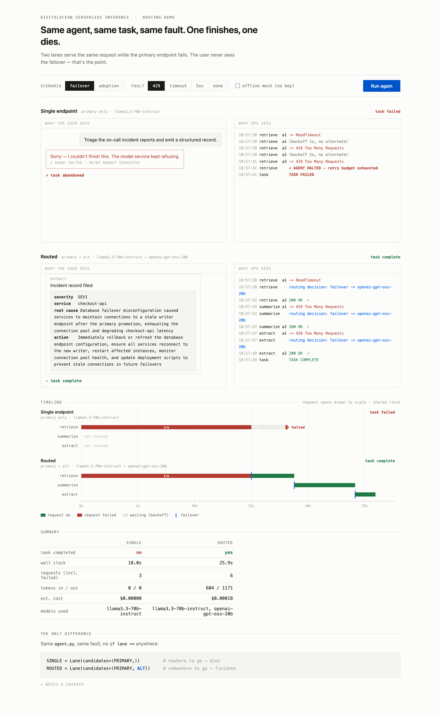

# agent-resilience-demo

**The same agent, the same task, the same fault. One finishes. One dies.**

The only difference between the two lanes is where they send their inference —
one fixed endpoint, versus DigitalOcean Serverless Inference behind routing.

**▶ Live: https://agent-resilience-demo-q7rzp.ondigitalocean.app**



*(Actual output from the live app against the real DO API — not a mockup.)*

## Run it

```sh
make web                  # dashboard -> http://localhost:8080
```

No key? Tick the **MOCK** toggle in the UI — canned upstream, no network. Or:

```sh
cp .env.example .env      # add DIGITALOCEAN_INFERENCE_KEY
make health               # do the pinned models actually answer? RUN THIS FIRST
make web
```

Hit **Run**. Each lane is shown front-stage/back-stage: the left pane is the
agent conversation the end user sees, the right pane is the decision log ops
sees, and a to-scale request timeline sits below. The single-endpoint lane's
user watches a typing indicator die into an apology; the routed lane's user
gets their incident report and never learns a failover happened — the 429s and
routing decisions exist only in the ops pane. There's also a terminal version
(`make demo`) that prints the same decision log with `rich`.

## Vary it

| Control | Default | What it does |
|---|---|---|
| fault | `429` | `429` (~5s, use this live), `5xx` (~5s), `timeout` (~50s — the single lane really does sit there; dramatic, but don't open with it), `none` (clean run, ~5s — show this first so they see both lanes healthy) |
| MOCK | off | Local canned upstream. No key, no network, byte-identical runs. |
| `make demo FAIL_AFTER=2` | `1` | Start failing after N requests **per lane**. `1` breaks `summarize`. |
| `make demo FAIL_DURATION=90` | `60` | Seconds the fault persists. The injector rejects values too short to be deterministic. |

## Deploy

Running on App Platform at the link above. To deploy your own:

```sh
# 1. point .do/app.yaml's git.repo_clone_url at your fork, then:
doctl apps create --spec .do/app.yaml

# 2. set the key (do NOT put it in the committed spec):
doctl apps update <APP_ID> --spec <(sed "s|# value: .*|value: $DIGITALOCEAN_INFERENCE_KEY|" .do/app.yaml)

# 3. re-deploy after a push (a plain git source has no deploy-on-push):
doctl apps create-deployment <APP_ID>
```

Without the key the app still boots and the MOCK toggle still works — that's
your fallback if a key isn't available on stage. `make docker` runs the same
image locally.

The build is a `python:3.11-slim` base pinned **by digest**, installing
`requirements.lock` with `--require-hashes`. If you regenerate that lock, read
its header first — resolving it on the wrong interpreter breaks the build in a
way that only shows up on 3.11/3.12.

## How it works

```
                    ┌──────────────────────────────────────┐
   agent.py ───────►│ proxy/  (deterministic fault injector)│
   (identical       │   counts requests PER LANE            │
    for both        │   after N: inject 429/timeout/5xx     │
    lanes)          └───────┬──────────────────────┬────────┘
                            │ /u/primary           │ /u/alt
                            ▼                      ▼
                     llama3.3-70b-instruct   openai-gpt-oss-20b
                        (sick)                   (healthy)

   single lane  candidates = (primary,)       ← nowhere to go, burns retries, dies
   routed lane  candidates = (primary, alt)   ← routes around it, finishes
```

The agent code is **identical** for both lanes — `agent.py` never learns which
lane it's in, and `client.py` has no `if lane ==` in it. The lanes differ by a
tuple length in `lanes.py`, and nothing else. The web build imports those same
modules rather than reimplementing them, so opening a browser can't quietly turn
the claim into a lie.

Failure is **injected, not provoked**: a demo that waits for a real provider's
rate limiter to fire on cue isn't reproducible. The injector counts per lane, so
the two concurrent lanes can't perturb each other's schedule. Same flags → same
outcome, every run, any machine — verified by diffing three runs.
`config.assert_deterministic()` refuses flag combinations where the fault window
could close mid-retry and let the single lane survive by luck.

One container runs the dashboard, the injector, and the mock upstream, because
App Platform deploys one container and a demo that needs a process manager is a
demo that breaks on stage.

## What this does NOT claim

- **This is not a latency benchmark.** The routed lane is often *slower* — it
  makes an extra failed request before failing over. Ignore the wall clock. If
  you quote timings from this repo, you have misread it.
- **Not a model quality comparison.** Two models are configured as different
  backends to make failover meaningful, not to rank them.
- **The 429s are synthetic.** They say nothing about any provider's real limits.
- **Cost figures are placeholder estimates** from `config.PRICE_PER_MTOK`. DO
  doesn't publish per-model token pricing in its catalog. Not billing figures.

The one claim: **when an endpoint degrades, an agent with somewhere else to go
completes the task and an agent without one does not.**

## Before you present

Run `make health`. It takes 4 seconds and it is the check that matters.

`make models` only proves a model ID still *exists* in the catalog. That is a
different question from whether it will *answer*, and the gap is not academic:
during development the original alt pin (`openai-gpt-oss-120b`) was listed,
valid, and serving real `429 Platform overloaded` — so the routed lane failed
over into a backend that was itself down, and both lanes died. A failover target
that is degraded is not a failover target. `make health` catches that; `make
models` doesn't.

Then click through once with fault **none** and once with **429**. If the routed
lane ever fails, read the error rather than trusting the shape of the demo:
it is far more likely to be your alt model misbehaving than the routing story.

## Scars

Things this repo learned the hard way, kept here because each one is a way a
live demo dies:

- **A listed model is not a working model.** See above. → `make health`.
- **Don't tune timeouts against a mock.** `REQUEST_TIMEOUT_S=4` looked fine
  against a 0.25s canned upstream; the real 70B took 2.4s and the resulting fake
  ReadTimeout silently ate a fault-injector count and desynced the whole run.
- **Reasoning models spend tokens before they answer.** `max_tokens=400` cut
  `gpt-oss-20b`'s JSON in half *intermittently* (observed peak: 535 completion
  tokens), and it surfaced as `no JSON object in model output` — a truncation
  bug wearing a parsing bug's clothes. `client.py` now names it.
- **Lock for the interpreter you deploy on, not the one you author on.** `anyio`
  needs `typing_extensions` only below 3.13; a lock resolved on 3.14 omits it and
  then `--require-hashes` fails on every 3.11/3.12 machine. It killed the first
  App Platform build.
- **Look at your own dashboard.** Stat cards were appended in completion order,
  so the *failing* lane displayed the winner's numbers. Every API check passed.
  Only a screenshot caught it.

## Fork it

Swap `CORPUS` and the three prompts in `agent.py` for your scenario; adjust the
pins in `config.py`. Everything else holds. ~20 minutes.

## Next: Fusion integration

*(stub)* Fusion would replace the hand-rolled candidate list in `lanes.py` with
real policy — health-aware routing, circuit breaking, and cost/latency-based
model selection — so the failover decision comes from the platform rather than
from a tuple. The demo's seam is deliberately at `Lane.candidates`: that's the
single place a Fusion-backed router would plug in. Note that the routed lane
currently restarts at `primary` for every step; a real router would circuit-break
and stop dialling a backend it already knows is sick.

---
`make demo` also writes `out/run-<timestamp>.jsonl` — one JSON object per
decision, diffable across runs and pasteable into a doc.
